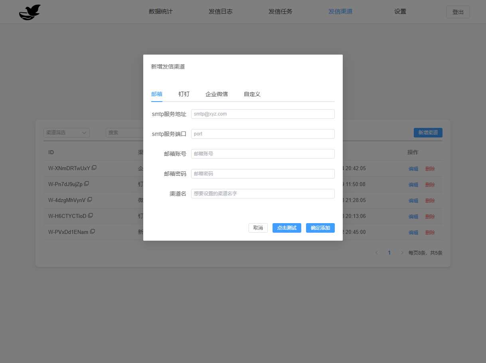
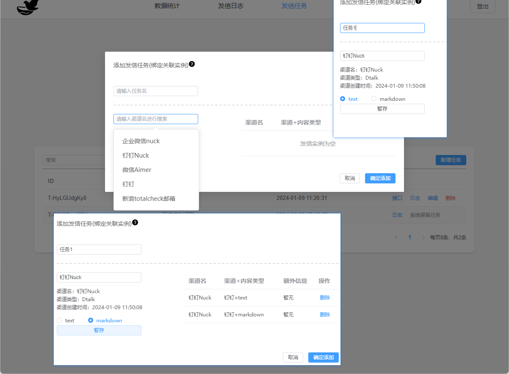

# Message Nest 🕊️

Message Nest 是一个灵活而强大的消息推送整合平台，旨在简化并自定义多种消息通知方式。

项目名叫信息巢，意思是一个拥有各种渠道信息方式的集合站点。

如果你有很多消息推送方式，每次都需要调用各种接口去发送消息到各个渠道，或者不同的项目你都需要复制同样的发消息代码，这个项目可以帮你管理各种消息方式，并提供统一的发送api接入。你可以自由组合各种消息渠道，一个api推送到各种渠道，帮你省去接入的繁琐步骤。

演示站点(演示站点的服务器比较烂，见谅) [demo](https://demo-message-nest.engigu.cn/)

## 特色 ✨

- 🔄 **整合性：** 提供了多种消息推送方式，包括邮件、钉钉、企业微信等，方便你集中管理和定制通知。
- 🎨 **自定义性：** 可以根据需求定制消息推送策略，满足不同场景的个性化需求。
- 🛠 **开放性：** 易于扩展和集成新的消息通知服务，以适应未来的变化。

## 进度 🔨

项目还在不断更新中，欢迎大家提出各种建议。

关于日志，考虑到目前多数服务以收集控制台输出为主，暂时不支持写出日志文件。

2024.01.24

- [x] 支持数据统计展示

2024.01.20

- [x] 添加日志查看自动刷新

2024.01.07

- [x] 支持站点信息自定义

2024.01.03

- [x] 支持企业微信


- [x] 单应用打包,直接运行,不用部署前端页面
- [x] 支持邮件发送
- [x] 用户密码设置
- [x] 支持用户定时任务清理，更新定时时间
- [x] 查看定时清理日志
- [x] 单应用的html浏览器自动缓存
- [x] gin的日志使用logrus
- [x] 支持异步发送
- [x] 支持邮件发送
- [x] 支持钉钉
- [x] 支持自定义的webhook消息发送
- [x] 企业微信
- [ ] ....

## 项目来由 💡

自己常常写一些脚本需要消息推送，经常需要接入不同的消息发送，很不方便，于是就有了这个项目。

## 效果图 📺


## 使用方法 🚀

<details>
  <summary>1. 直接运行最新的release打包的可执行文件（推荐，不用部署前端页面）</summary>

1. 下载最新的系统版本对应的release， 解压
2. 新建一个数据库
3. 重命名conf/app.example.ini为conf/app.ini
4. 修改app.ini对应的配置
5. 将配置中`EmbedHtml = disable`, 进行注释，以单应用方式运行，完整配置参考如下：

```ini
[app]
JwtSecret = message-nest
LogLevel = INFO

; 第一次运行务必打开，初始化数据
InitData = enable

[server]
RunMode = release
HttpPort = 8000
ReadTimeout = 60
WriteTimeout = 60
; 注释EmbedHtml，启用单应用模式
; EmbedHtml = disable

[database]
; 关闭SQL打印
; SqlDebug = enable

Type = mysql
User = root
Password = Aa123456
Host = vm.server
Port = 3308
Name = yourDbName
TablePrefix = message_

```

6. 启动项目会自动创建表和账号

```shell
# 第一次运行将app.ini中的app.InitData设置为enable，会自动进行表数据的初始化
# 后续不需要开启这个配置
# INFO日志级别启动回出现如下日志

[2024-01-13 13:40:09.075]  INFO [migrate.go:70 Setup] [Init Data]: Migrate table: message_auth
[2024-01-13 13:40:11.778]  INFO [migrate.go:70 Setup] [Init Data]: Migrate table: message_send_tasks
[2024-01-13 13:40:16.518]  INFO [migrate.go:70 Setup] [Init Data]: Migrate table: message_send_ways
[2024-01-13 13:40:23.300]  INFO [migrate.go:70 Setup] [Init Data]: Migrate table: message_send_tasks_logs
[2024-01-13 13:40:28.715]  INFO [migrate.go:70 Setup] [Init Data]: Migrate table: message_send_tasks_ins
[2024-01-13 13:40:39.538]  INFO [migrate.go:70 Setup] [Init Data]: Migrate table: message_settings
[2024-01-13 13:40:46.299]  INFO [migrate.go:74 Setup] [Init Data]: Init Account data...
[2024-01-13 13:40:46.751]  INFO [migrate.go:77 Setup] [Init Data]: All table data init done.

```

7. 启动项目，访问8000端口，初始账号为admin，密码为123456

</details>


<details>
  <summary>2. 前后端分离部署（待更新）</summary>
</details>


[//]: # (1. 前端项目构建)

[//]: # (```shell)

[//]: # (cd web && npm i && npm run build)

[//]: # (```)

[//]: # (2. 配置配置文件，参考上面，需要注意将配置中`EmbedHtml = disable`取消注释)

[//]: # (3. 启动go服务)

[//]: # (```shell)

[//]: # (go mod tidy)

[//]: # (CGO_ENABLED=0 go build -o Message-Nest)

[//]: # (./Message-Nest)

[//]: # (```)

[//]: # (4. 配置Nginx，将静态文件)

[//]: # (5. 配置Nginx，将后端接口转发)

<details>
  <summary> 3. 开发调试运行</summary>

1. 重命名conf/app.example.ini为conf/app.ini， 关键配置如下

```ini
[app]
JwtSecret = message-nest
LogLevel = INFO

; 第一次运行务必打开，初始化数据
InitData = enable

[server]
; RunMode务必设置成debug，会自动添加跨域
RunMode = debug
HttpPort = 8000
ReadTimeout = 60
WriteTimeout = 60
; 取消EmbedHtml的注释（启用前后端分离），然后到web目录下面，npm run dev启动前端页面
EmbedHtml = disable

[database]
; 开启SQL打印
SqlDebug = enable

Type = mysql
User = root
Password = Aa123456
Host = vm.server
Port = 3308
Name = yourDbName
TablePrefix = message_

```

2. 运行main.go，服务启动后会运行在8000端口

```shell
go mod tidy
go run main.go
```

3. 启动前端页面，页面启动后会提示访问url，一般是`http://127.0.0.1:5173`

```shell
cd web
npm i
npm run dev
```

4. 访问`http://127.0.0.1:5173`，进行调试开发，接口会自动转发到go服务`http://localhost:8000`

</details>

<details>
  <summary>4. docker/docker-compose部署（推荐）</summary>

<details>
  <summary>docker部署</summary>

1. 新建一个数据库，准备一个conf文件夹
2. 新增conf/app.ini
3. 修改app.ini对应的配置
4. 将配置中`EmbedHtml = disable`, 进行注释，以单应用方式运行，完整配置参考如下：

```ini
[app]
JwtSecret = message-nest
LogLevel = INFO

; 第一次运行务必打开，初始化数据
InitData = enable

[server]
RunMode = release
; docker模式下端口配置文件中只能为8000
HttpPort = 8000
ReadTimeout = 60
WriteTimeout = 60
; 注释EmbedHtml，启用单应用模式
; EmbedHtml = disable

[database]
; 关闭SQL打印
; SqlDebug = enable

Type = mysql
User = root
Password = Aa123456
Host = vm.server
Port = 3308
Name = yourDbName
TablePrefix = message_

```

6. 使用命令启动，端口使用`-p`自定义

```shell
docker pull engigu/message-nest:latest
# 测试运行
docker run --rm -ti -p 8000:8000 -v /your/path/conf:/app/conf engigu/message-nest:latest 
# 正式运行
docker run -d -p 8000:8000 -v /your/path/conf:/app/conf engigu/message-nest:latest 
```

7. 启动项目，访问8000端口，初始账号为admin，密码为123456
</details>

<details>
  <summary>docker-compose部署</summary>

1. 准备app.ini，文件内容如上docker部署
2. 准备docker-compose.yml，内容如下：

```yml
version: "3.7"
services:

  message-nest:
    image: engigu/message-nest:latest
    container_name: message-nest
    restart: always
    volumes:
      - ./conf:/app/conf
    ports:
      - "8000:8000"
```

3. 文件目录结构

```shell
.
├── conf
│   └── app.ini
├── docker-compose.yml

```

4. 启动项目

```shell
# 测试运行
docker-compose up
# 正式运行
docker-compose up -d
```
</details>

<details>
  <summary>docker/docker-compose环境变量部署（推荐）</summary>

环境变量介绍

```shell
JWT_SECRET   jwt秘钥，可选，默认为message-nest
LOG_LEVEL    日志等级，可选，默认为INFO，DEBUG/INFO/ERROR
INIT_DATA    是否初始化数据，可选，默认关，第一次运行需要将该值设置为enable
RUN_MODE     运行模式，可选，默认release，为debug将自动添加跨域

MYSQL_HOST    mysql-host，必填
MYSQL_PORT    mysql端口，必填
MYSQL_USER    mysql用户名，必填
MYSQL_PASSWORD    mysql密码，必填
MYSQL_DB     mysql数据库名字，必填
MYSQL_TABLE_PREFIX     mysql数据表前缀，必填
SQL_DEBUG     是否打印SQL，可选，默认关，设置enable为开启
```

docker运行

```shell
# 首次运行初始化数据
docker run --rm -ti -p 8000:8000 -e INIT_DATA=enable  -e MYSQL_HOST=192.168.64.133  -e MYSQL_PORT=3308 -e MYSQL_USER=root -e MYSQL_PASSWORD=Aa123456 -e MYSQL_DB=test_11 -e MYSQL_TABLE_PREFIX=message_ engigu/message-nest:latest 

# 正式运行
docker run -d  -p 8000:8000 -e INIT_DATA=enable  -e MYSQL_HOST=192.168.64.133  -e MYSQL_PORT=3308 -e MYSQL_USER=root -e MYSQL_PASSWORD=Aa123456 -e MYSQL_DB=test_11 -e MYSQL_TABLE_PREFIX=message_ engigu/message-nest:latest 
```

docker-compose运行

```yml
version: "3.7"
services:

  message-nest:
    image: engigu/message-nest:latest
    container_name: message-nest
    restart: always
    ports:
      - "8000:8000"
    environment:
      - INIT_DATA=enable  # 首次运行需要初始化
      - MYSQL_HOST=192.168.64.133
      - MYSQL_PORT=3308
      - MYSQL_USER=root
      - MYSQL_PASSWORD=Aa123456
      - MYSQL_DB=test_11
      - MYSQL_TABLE_PREFIX=message_
```

```shell
# 测试运行
docker-compose -up

# 正式运行
docker-compose -up -d
```

</details>

</details>

#### 关于EmbedHtml配置的说明

> 这个配置可以理解为单应用模式（或者前后端分离）的开关
>  1. 取消这个配置的注释，表示前后端分离，表示go服务启动的时候只会有api服务，需要到web目录下，npm run
      dev启动前端项目。然后访问前端项目提示的端口服务，一般是127.0.0.1:5173。
      或者使用npm run build，用Nginx部署前端。
>
>
> 2. 注释这个配置，表示单应用，启动go服务，会把web/dist目录下文件作为前端静态资源。
     如果目录下没有静态资源文件，需要到web目录下，npm run build构建生成。
>
> 两种方式各有优缺点，综合考虑下来，推荐直接使用release的打包执行文件，其中已经内置了页面静态资源，只用运行一个服务。

## 完整配置说明 ⚙️

<details>
  <summary>点击展开</summary>

```ini
[app]
JwtSecret = message-nest
; 暂时无用
RuntimeRootPath = runtime/
LogLevel = INFO

; init table data, first run set enable
; 首次运行打开这个，会自动初始化表和数据
; 项目升级需要打开这个进行检测新增表字段创建
InitData = enable

[server]
; debug or release
; debug模式下会自动添加跨域headers
RunMode = release
HttpPort = 8000
ReadTimeout = 60
WriteTimeout = 60
; use embed html static file
; 是否使用embed打包的静态资源
; 如果运行release打包后的应用，请注释这个设置。
; 如果取消这个注释，只会单独运行api服务，前端页面需要到web目录手动npm run dev, 运行前端服务
; EmbedHtml = disable   

[database]
Type = mysql
User = root
Password = password
Host = 123.1.1.1
Name = db_name
Port = 3306
; 表前缀
TablePrefix = message_
; 是否打开sql打印
; SqlDebug = enable
```

</details>

## 页面操作指引 🎞️

关于消息的添加，发送的整个步骤，是以顶部菜单栏从右向左进行操作。

<details>
  <summary>1. 新增发信渠道（添加消息的具体渠道）</summary>



参考各个渠道tab的说明进行设置保存

注意现在的自定义webhook形式，只支持`POST`请求，采用的是替换配置的消息体中的占位符`TEXT`，进行发送消息

</details>

<details>
  <summary>2. 新增发信任务</summary>



1. 点击渠道输入框会弹出所有渠道选项
2. 选择一个渠道会出现渠道的明细信息，并选择一种消息类型，进行暂存成为实例，点击确定才会进行最终的保存
3. 添加任务的页面实际上，会分别添加任务，以及任务关联的渠道实例
4. 关于任务与实例的说明：

> 一个任务可以关联创建多个实例
>
>  选择不同的渠道，填写的实例信息也不一样
>
>  一个任务可以绑定一个实例，也可以绑定多个实例，多个实例意味着一个消息可以推送给多个消息渠道

5. 关于实例的消息类型说明：

> 消息的类型大体上可以分为text、html、markdown三种类型。每种渠道消息现在支持的类型有不同的限制。
>
>  在实际发送的时候，会优先选择发送api中传过来对应类型的消息，如果api中没有对应的类型，会直接取api中text消息。
>
>  api中text消息在发送的时候必须要传

</details>

<details>
  <summary>3. 消息发送</summary>


参考各种语言的接口进行调用

</details></details>

## 贡献 🤝

欢迎通过提交问题和提出改进建议。

## 致谢 🙏

该项目汲取了[go-gin-example](https://github.com/eddycjy/go-gin-example)项目的灵感，展示了 Go 和 Gin 在实际应用中的强大和多才多艺。

## 许可证 📝

[LICENSE](LICENSE)

